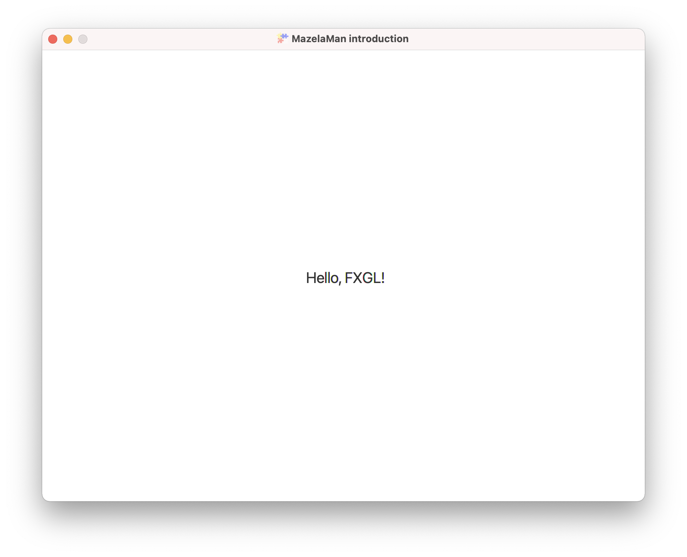
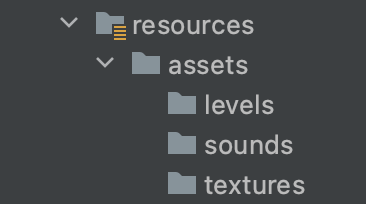
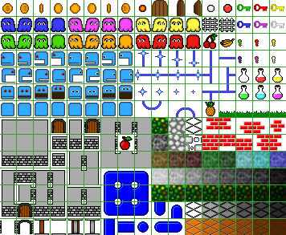
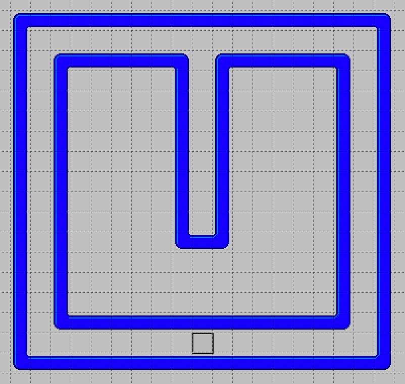
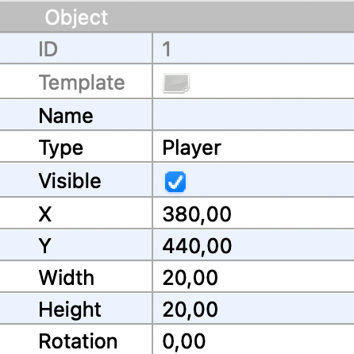
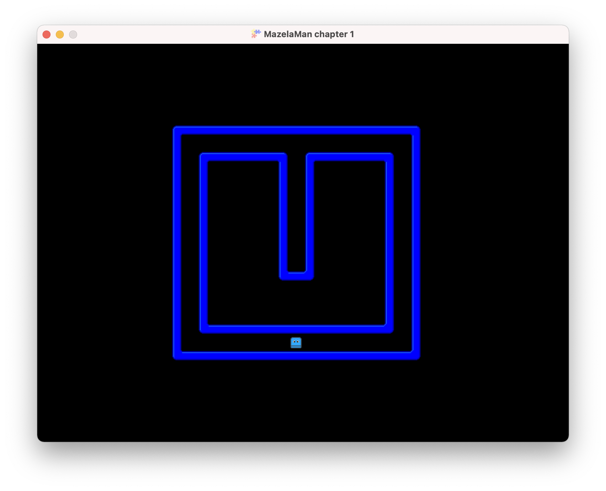
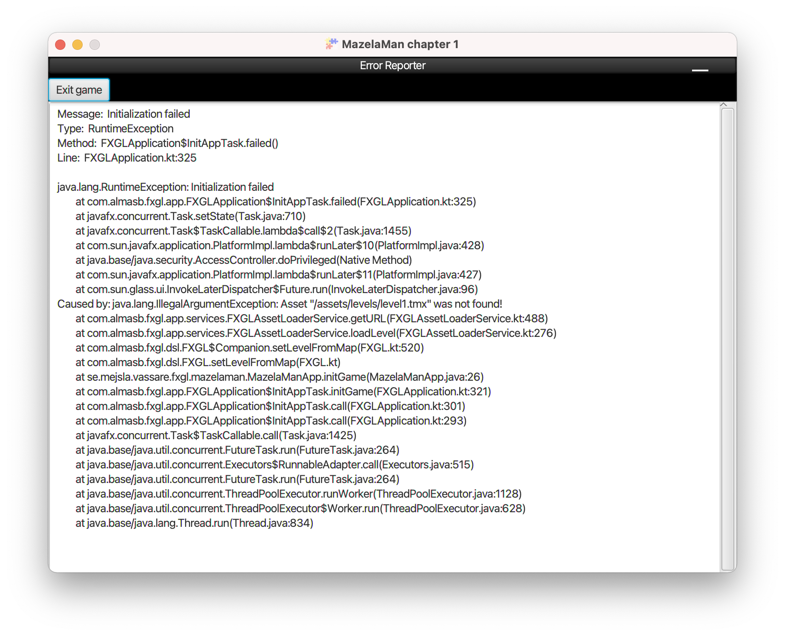

## Basic App

We start with a very basic app, the "Hello, World!" of FXGL. If you run this app,
called `MazelaManApp`, you will be presented with a window similar to this.



The first thing that happens here is that our main method calls `GameApplication.launch` 
to start the app. After that, FXGL is in control, and makes callbacks to initialize
and run our app. A look in the `GameApplication` class reveals several methods that
can be used to initialize input, physics and so on, but in this basic app we override
only two of them, `initSettings` to set some basic settings like the window size, and
`initUI` to create the single label that makes up our UI.

```java
    @Override
    protected void initUI() {
        Label label = new Label("Hello, FXGL!");
        label.setFont(Font.font(20.0));
        FXGL.addUINode(label, 350.0, 290.0);
    }
```

The `Label` class, and the `Font` class used in `initUI` are the normal JavaFX `Label` and 
`Font` classes used in any JavaFX application. Thus, having some knowledge of JavaFX will 
help you when developing a game with FXGL, but it is not necessary

The call to `FXGL.addUINode` will add the label at the specified location and make it visible.
The class `FXGL` is a facade that gives us access to much of FXGL, and we will see many calls
to the static methods in class `FXGL`.


## Creating a Level

The first thing we want to do is to create a level that can be loaded into FXGL and 
displayed in the main window. The level file will contain information on the images 
(tiles) to display in the window, and some objects that we can control or interact with.
We will create and edit level files using the [Tiled](https://www.mapeditor.org) application.


### Folder Structure

FXGL uses the Convention over Configuration paradigm, and expects resource files to be
found in a certain folder structure. Let's start by creating that folder structure in the
resources folder:




### Creating the Level File

An easy way to get started is to copy an "empty" level file from the main resources
folder to our newly created levels folder. Copy the level file from [here](../resources/empty-level.tmx)
and give it the name "level1.tmx". You also need to copy the [tilemap](../resources/tilemap.png) 
file to the levels folder. The tilemap file is a PNG file that contains all the images (tiles) 
that we will use when designing the level. The tilemap file we are going to use looks like this.



If you do not have access to the Tiled application, or do not want to edit the level file yourself, 
you can simply copy [the level file from the next chapter](../01-chapter-1/src/main/resources/assets/levels/level1.tmx) 
instead.


### Editing the Level File

Tiled is not going to be the focus of this tutorial, so editing levels in Tiled will be described
somewhat briefly. A level is divided into layers. Our level has two layers - a Tile Layer, and an 
Object Layer. On the Tile Layer, we will put the tiles that define the looks of the level, and on
the Object Layer, we will put any objects that exist in the game. In FXGL, the objects are called
entities. In this step, we will have only one object or entity, and that is the Player.

You can design your level any way you like, but mine looks like this:



Notice the small square near the bottom of the image. That is the Player object! If you click on
the Player object, the property editor on the left will display the properties of the Player object.



Something important to notice about the Player object is the type, which must be "Player". That is
how FXGL knows that it should spawn a Player entity when loading the level.

When you are happy with your level design, save it, and return to your IDE.


## Entity Factory

Entities in FXGL are created by an entity factory. We must create an entity factory that has the
ability to create Player entities. Let's call our factory `MazelaManFactory` to fit with the name 
of the app.

```java
public class MazelaManFactory implements EntityFactory {

    @Spawns("Player")
    public Entity spawnPlayer(SpawnData data) {
        return entityBuilder(data)
                .viewWithBBox("player.png")
                .build();
    }
}
```

The `spawnPlayer` method of the factory is annotated with the `@Spawn` annotation. That is how FXGL knows
what type of entity to spawn. The value of the `@Spawn` annotation must match the type used in Tiled
exactly. In the method, we create an entity builder with some data we received, and we add a view
with a bounding box to it, and finally build the entity. The `SpawnData` class contains the position
of the entity to spawn, as well as some additional data like the width and height of the entity.
However, in our case, the width and height is taken from the view.

The view of an entity defines how it is represented on the screen. It can be an image as in this case,
but it can also be a geometrical figure like a circle. In fact, the view can be any JavaFX `Node`, so
we could make our view a `Label` or a `Button`. The bounding box of an entity defines the outer
perimeter of the entity, and is used when detecting collisions between entities.

Images that make up the visual part of an entity are called textures. We quickly realize that we 
are now missing the "player.png" texture needed to make this work. Fortunately, we can copy 
[player.png](../resources/player.png) to the textures folder.

While in the entity factory, let's also add another spawn method, to create a black background for
our game.

```java
    @Spawns("Background")
    public Entity spawnBackground(SpawnData data) {
        return entityBuilder(data)
                .view(new Rectangle(data.<Integer>get("width"), data.<Integer>get("height"), Color.BLACK))
                .with(new IrremovableComponent())
                .zIndex(-100)
                .build();
    }
```

This method spawns entities of type "Background" that have a view, but no bounding box. That is 
because the background is not supposed to interact with the other entities. To place the background
firmly in the background, we give it a `zIndex` of -100 which will render it behind all other entities.


## Loading the Level

Let's now turn our attention to the main class, where we want to add code to actually load the level
and start our game. We remove the `initUI` method that we don't need at the moment, and instead add a
method to initialize the game.

```java
    @Override
    protected void initGame() {
        getGameWorld().addEntityFactory(new MazelaManFactory());
        spawn("Background", new SpawnData(0, 0).put("width", WIDTH).put("height", HEIGHT));
        setLevelFromMap("level1.tmx");
    }
```

First, we let FXGL know of our entity factory. Second, we manually spawn the background by calling
the `spawn` method of the FXGL facade. The arguments of the version of the `spawn` method we use are the
entity type, and the spawn data that is used to place the entity in the window. Finally, we load the
level into FXGL. The `setLevelFromMap` method will read the level file, render the tiles, and create
the entities defined as objects in the level file. It expects, as previously mentioned, the level
file to exist in a specific folder, namely "resources/assets/levels".

If you run your application again, you will see something that looks like this.



If you instead get an error message similar to below, you probably need to run Maven to copy
the resources to the target folder. You can do this in your IDE, or on the command line:

```shell
mvn compile
```



This concludes the introduction of the tutorial. Now you can proceed to [chapter 1](../01-chapter-1/README.md).

[[Next](../01-chapter-1/README.md)]
[[Up](../README.md)]
