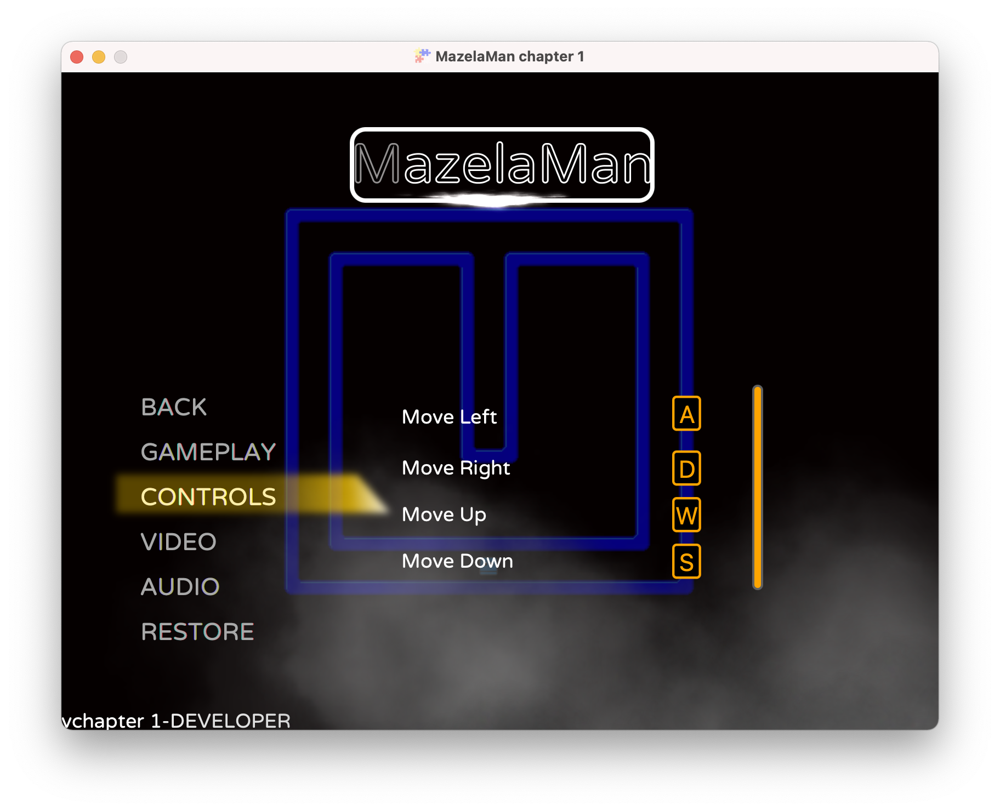
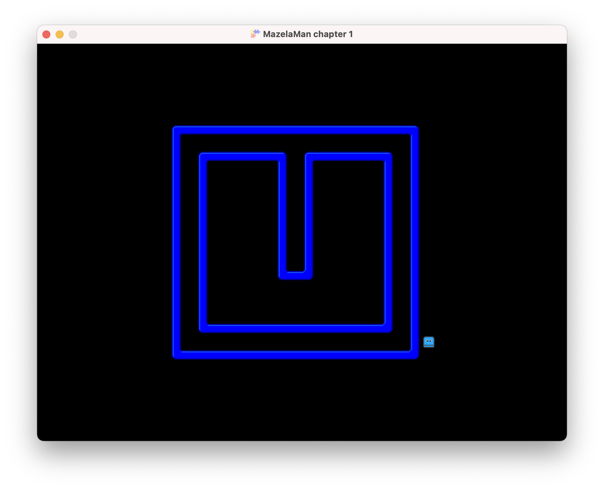

## Handling Input

Now we have set the scene for our game. The next step is to make it interactive. We want the
player character to move when we press a key. FXGL has bindings for both keyboard and mouse 
input, but in this tutorial we will only use keyboard input.


### Getting the Player Entity

To move the player entity, we first must retrieve it from the game world somehow. To do this
we need to define an enum that serves as the entity type. Do not confuse the entity type with 
the type string used in Tiled to make FXGL spawn an entity. The enum `EntityType is used when
finding entities in a live game world.

```java
public enum EntityType {
    PLAYER
}
```

Now we can modify the `spawnPlayer` method to set this type on the entity being created. We call
the builder method `type`.

```java
    @Spawns("Player")
    public Entity spawnPlayer(SpawnData data) {
        return entityBuilder(data)
            .type(EntityType.PLAYER)
            .viewWithBBox("player.png")
            .build();
        }
```

The spawned player will now have the entity type `PLAYER`, and FXGL lets us find entities by
type. We add a convenience method to `MazelaManApp` to get the player entity.

```java
    private static Entity getPlayer() {
        return FXGL.getGameWorld().getSingleton(EntityType.PLAYER);
    }
```


### Registering User Actions

When we have a way to get the player entity, so it can be updated, we need to tell FXGL that
we are interested in certain key presses by registering user actions for those keys. The FXGL
`GameApplication` base class has a callback method we can override to do that. It is called
`initInput`. In this method we can call one or more methods on the FXGL facade to register the
user actions, like this:

```java
    @Override
    protected void initInput() {
        FXGL.onKey(KeyCode.A, "Move Left", () -> getPlayer().translateX(-SPEED));
        ...
    }
```

The code above registers a user action that runs when the `A` key is pressed. The name of the
action is "Move Left". This name actually has a meaning, as we will see soon. When the action 
runs, we get the player entity and move it some amount to the left. For this to work, we 
obviously need to define the constant `SPEED` as well.

```java
    private static final int SPEED = 2;
```

The methods `translateX` and `translateY` move the entity relative to its current location. There
are also methods `setX` and `setY` that move the entity to an absolute location. Note that there
is no physics involved here. There are no forces that affect the entity. It only moves when
we tell it to move.

There are other ways to register user actions. If you want more fine-grained control of how
to react to button presses, you can instead register a `UserAction` instance, and override the
methods you need.

```java
        FXGL.getInput().addAction(new UserAction("Move Left") {
            @Override
            protected void onAction() { }

            @Override
            protected void onActionBegin() { }

            @Override
            protected void onActionEnd() { }
        }, KeyCode.A);
```

To finish up, here is the complete `initInput` method.

```java
    @Override
    protected void initInput() {
        FXGL.onKey(KeyCode.A, "Move Left", () -> getPlayer().translateX(-SPEED));
        FXGL.onKey(KeyCode.D, "Move Right", () -> getPlayer().translateX(SPEED));
        FXGL.onKey(KeyCode.W, "Move Up", () -> getPlayer().translateY(-SPEED));
        FXGL.onKey(KeyCode.S, "Move Down", () -> getPlayer().translateY(SPEED));
    }
```


## Game Menu

I mentioned before that the name of the action has a meaning, and now we will see how. FXGL
has a built-in game menu that we get for free in all games. It contains sub menus for setting
properties that most games need, including key bindings. So we get for free, the ability to
let the user choose their own key bindings. If you want, you can also add a main menu that
is displayed when the game is started.

The game menu is accessed by pressing the Esc key while the game is running. Try this, and
then click Options and then Controls. This will display the sub menu for choosing key bindings
and here you will see the action names we entered before.



If you try the game as it is now, you soon find a major problem. The player can move through
walls! In fact, it can even move off-screen. To solve this problem we will add physics and
collisions in the [next chapter](../02-chapter-2/README.md).



[[Back](../00-introduction/README.md)]
[[Next](../02-chapter-2/README.md)]
[[Up](../README.md)]
