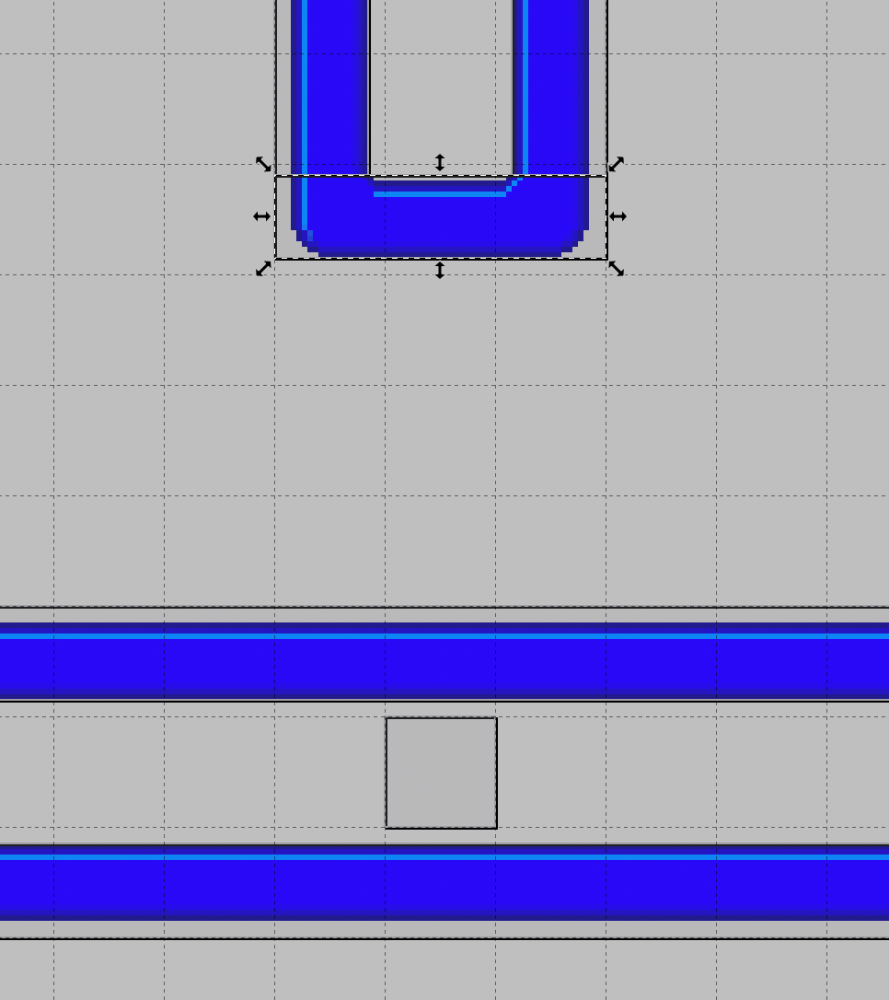
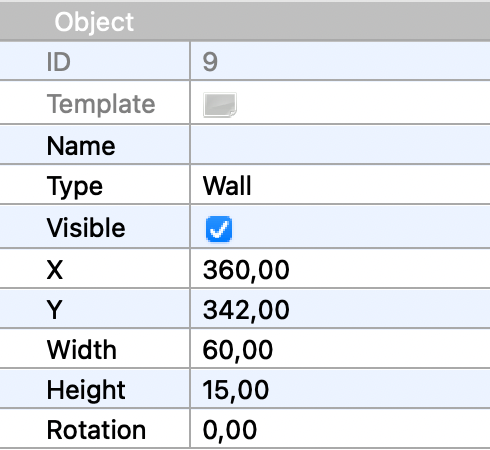

## Physics

The reason the player can move through the walls is that the walls do not "exist" in the game.
As of now, they are only images, and not entities. To fix this we are going to create objects
for the walls in Tiled.

As before, if you don't want to use Tiled, you can copy the level file from the 
[next chapter](../03-chapter-3/src/main/resources/assets/levels/level1.tmx). The tilemap is
still the same.

Start Tiled and open the level file for the current chapter. Select the Object Layer in the 
Layers area, and start adding objects for the walls on top of the tiles. Try to make the wall
objects fit as close as possible to the wall tiles. That becomes easier if you set snapping
to "Snap to pixels" in View-->Snapping.

Here is a closeup of a part of my level including objects for the walls.



Note that you need to set the type string of all wall objects to "Wall" in the property editor.
This type string will again be used in the entity factory to spawn the correct entity.



Remember to save the level file when you are done with the walls.


### Wall Entities

Now that we have added the walls as objects in the level file, we again turn our attention to
the entity factory. Let's add a spawn method for walls.

```java
    @Spawns("Wall")
    public Entity spawnWall(SpawnData data) {
        return FXGL.entityBuilder(data)
                .type(EntityType.WALL)
                .bbox(new HitBox(BoundingShape.box(data.<Integer>get("width"), data.<Integer>get("height"))))
                .with(new PhysicsComponent())
                .build();
    }
```

We annotate this method with `@Spawn("Wall")` to match it with what is in the level file. We set
the entity type to `EntityType.WALL`, which means we also need to add that enum constant to
the enum `EntityType`. We create a bounding box for the wall entity using data from the
`SpawnData`. The width and height read from `SpawnData` are of course the width and height we
saw in the Tiled property editor. Note that wall entities do not have any view. They are 
invisible entities, and that is because we drew them using tiles in Tiled. Entities that remain in
the same position during the entire level can be drawn in the Tiled editor, while entities that
move, or appear and disappear again, must be created with a view when they are created by the
entity factory.

The last thing to note about the new spawn method is that we give the entity a `PhysicsComponent`.
FXGL is highly componentized, you can add any number of predefined or custom components to an
entity. All components will receive callbacks when they are added or removed, and on each frame
during game play. In a later chapter we will create a custom component, but the `PhysicsComponent`
is one of the predefined components.

Adding a `PhysicsComponent` to an entity means giving up control of the entity. It will now be
managed by the physics engine. You can no longer move the entity by calling the translate 
methods. Instead, you will have to work with forces and velocities. It also means that the 
entity will interact with other entities managed by the physics engine. We will use that by
also letting the player entity be managed by the physics engine.


### Player Entity

Adding a `PhysicsComponent` for the player entity is a bit more complicated, because we want to
set some properties of the player body at the same time. FXGL uses [jbox2d](https://github.com/jbox2d/jbox2d)
to deal with physics, and the definitions below all relate to jbox2d. While it is beyond the
scope of this tutorial to explain the entire physics system of FXGL and jbox2d, some important
properties below will be described. There are many more properties to play with if you want.

```java
    @Spawns("Player")
    public Entity spawnPlayer(SpawnData data) {
        PhysicsComponent physics = new PhysicsComponent();
        physics.setFixtureDef(new FixtureDef().friction(0).density(0.1f));
        BodyDef bd = new BodyDef();
        bd.setFixedRotation(true);
        bd.setType(BodyType.DYNAMIC);
        physics.setBodyDef(bd);

        return FXGL.entityBuilder(data)
                .type(EntityType.PLAYER)
                .viewWithBBox("player.png")
                .with(physics)
                .build();
    }
```

We create a `PhysicsComponent`, and set a fixture on it. Fixtures contain some 
non-geometrical properties of physics bodies that are used for collision detection. We set 
the friction to 0, which means the player will glide along the walls. When you have completed 
this chapter, and have a working physics world, you can try to set the friction to something 
else, for example 0.5f, and notice what happens!

Next, we create a body definition that holds data used to create a rigid body.
By setting fixed rotation to true we prevent the body (that is, the player) from rotating when
it collides with another body, and by setting the body type to `DYNAMIC`, we get a body that 
has a velocity determined by forces and is moved by the physics engine.

Finally, we give the configured `PhysicsComponent` to the entity builder to attach it to the
player entity.


### Gravity and Forces

The physics world is ruled by forces, and one of the forces that is usually present is
gravity. However, we don't want any gravity in this game, so we will set it to zero. We can
initialize the physics world by overriding yet another method from `GameApplication`, this time
the method `initPhysics (surprise, surprise). We set the gravity both horizontally and 
vertically to zero. Later, you can try setting it to something else, and observe the force 
of gravity.

```java
    @Override
    protected void initPhysics() {
        FXGL.getPhysicsWorld().setGravity(0, 0);
    }
```

As noted before, we cannot move the player entity manually any longer, when it is managed by
the physics engine. Instead, we give the entity a velocity and watch it move automatically.
Let's rewrite the input handlers to access the `PhysicsComponent` of the player entity, and set
a velocity on it.

```java
    @Override
    protected void initInput() {
        FXGL.onKey(KeyCode.A, "Move Left", () -> getPlayer().getComponent(PhysicsComponent.class).setVelocityX(-SPEED));
        FXGL.onKey(KeyCode.D, "Move Right", () -> getPlayer().getComponent(PhysicsComponent.class).setVelocityX(SPEED));
        FXGL.onKey(KeyCode.W, "Move Up", () -> getPlayer().getComponent(PhysicsComponent.class).setVelocityY(-SPEED));
        FXGL.onKey(KeyCode.S, "Move Down", () -> getPlayer().getComponent(PhysicsComponent.class).setVelocityY(SPEED));
    }
```

The constant `SPEED` is now a velocity, and not a number of pixels to move, so it has to be 
updated too. A suitable value for the new `SPEED` constant could be 150.

When we run the game again, we can see that the player continues moving in the same direction 
until it is stopped by a wall. That is because there is no friction, and no gravity affecting 
it.

This is the end of chapter 2. In the [next chapter](../03-chapter-3/README.md) we will make
the game a bit more interesting by adding something for the player to eat.

[[Back](../01-chapter-1/README.md)]
[[Next](../03-chapter-3/README.md)]
[[Up](../README.md)]
