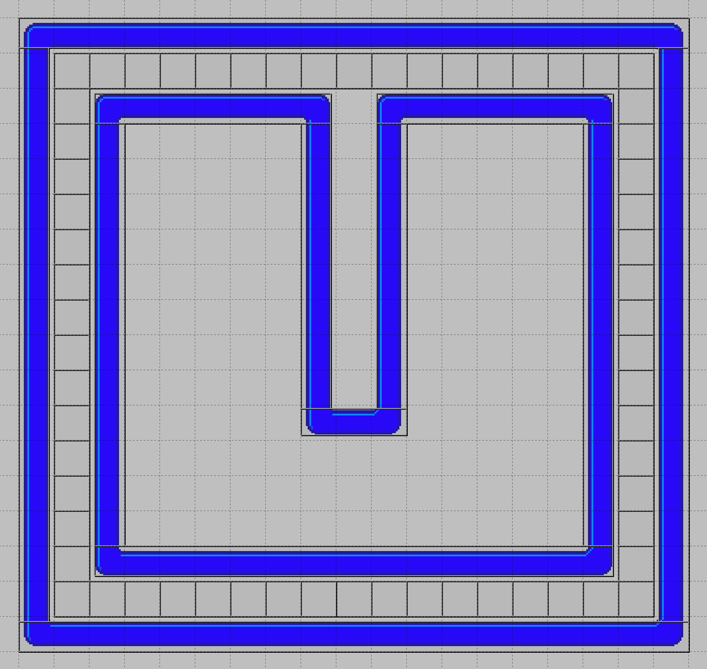
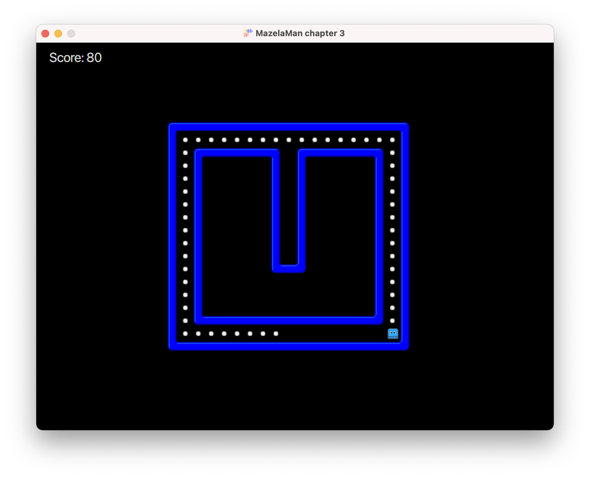

## Eating and Keeping Score

In this chapter, we will add pills for the player to eat, handle collisions to know when a pill
has been eaten, keep a score of the pills eaten, and display this score in the UI. We start as
usual, in the Tiled editor. A new version of the level file, with pills added, can be copied
from [here](../04-chapter-4/src/main/resources/assets/levels/level1.tmx).


### Adding Pills

Open the level file for this chapter in Tiled, and add objects for as many pills you want in 
your level. Make the objects 20x20 pixels in size, like a square in the grid. This will be 
easier to do if you set snapping to "Snap to Grid". Remember to set the type string of all pill
objects to "Pill". As you already know by now, we will use that string in the entity factory.

This is how my level looks in Tiled after adding all the pills.



In the entity factory, we add the corresponding spawn method.

```java
    @Spawns("Pill")
    public Entity spawnPill(SpawnData data) {
        return FXGL.entityBuilder(data)
                .type(EntityType.PILL)
                .view("pill.png")
                // Make hit box a little smaller than the tile to fit the visible part of the image
                .bbox(new HitBox("PILL_HIT_BOX", new Point2D(5, 5), BoundingShape.box(9, 9)))
                .collidable()
                .build();
    }
```

We need to create a new enum constant in `EntityType`, and we need to copy the pill image to the
textures folder from [here](../resources/pill.png).

This time we don't create the bounding box automatically from the image. That is because the 
image is 20x20 pixels, but the actual pill is only 9x9 pixels. To make the collision look 
better, we instead create a bounding box that is a little smaller than the image, trying to fit 
it to the actual pill.

We also call the `collidable` method on the builder, which is just a convenience method for 
adding a `CollidableComponent` to the entity. This lets the entity take part in FXGL's own
collision detection. We want the player entity to also be `collidable`, so we add that call to
the entity builder for the player entity as well.

```java
        return FXGL.entityBuilder(data)
                .type(EntityType.PLAYER)
                .viewWithBBox("player.png")
                .with(physics)
                .collidable()
                .build();
```


### Collision Detection

To facilitate collision detection, we update the `initPhysics` method to add a collision handler.

```java
    @Override
    protected void initPhysics() {
        PhysicsWorld physics = FXGL.getPhysicsWorld();
        physics.setGravity(0, 0);
        physics.addCollisionHandler(new CollisionHandler(EntityType.PLAYER, EntityType.PILL) {
            @Override
            protected void onCollisionBegin(Entity player, Entity pill) {
                pill.removeFromWorld();
            }
        });
    }
```

The arguments to the `CollisionHandler` constructor are the types of entities we want to handle
collisions between. The order is important here. The callback methods, like `onCollisionBegin`,
will receive their arguments in the same order as specified when calling the constructor. In
our case, we want to handle collisions between the player and a pill. We override the callback
method `onCollisionBegin` that is called just when a collision between two objects has started.
There are other callbacks like `onCollision`, that is called every frame while the collision
is happening.

In the callback method, we simply remove the pill from the game world. That makes the entity
disappear completely, with view and bounding box and all.


### Keeping Score

The player should score a number of points for each pill eaten, and we want to keep track of
that score, and display it in the UI. For that we will use a game variable. Game variables
are basically just a map from `String` to `Object`, a number of global variables used throughout
the game. In our case, we will only use it in the main app class, but there are benefits with
using game variables that we will take advantage of later.

We start by initializing the score to 0. That can be done in, you guessed it, the overridden
method `initGameVars`.

```java
    @Override
    protected void initGameVars(Map<String, Object> vars) {
        vars.put("score", 0);
    }
```

Next, we want to increase the score when the player eats a pill, so we update the collision
handler and add a statement to do that. The `inc` method is a convenience method that 
increments (or decrements) an integer game variable.

```java
    FXGL.inc("score", 10);
```

The final step is to display the score in the game window. Now we bring back the method
`initUI` to initialize a label to display the score.

```java
    @Override
    protected void initUI() {
        Label scoreLabel = new Label();
        scoreLabel.setTextFill(Color.LIGHTGRAY);
        scoreLabel.setFont(Font.font(20.0));
        scoreLabel.textProperty().bind(FXGL.getip("score").asString("Score: %d"));
        FXGL.addUINode(scoreLabel, 20, 10);
    }
```

Here we create a JavaFX label, like we did in the very first, Hello FXGL app. What is new
is that we bind the text property of the label to an integer property that represents the
score game variable, and at the same time transform the integer to a string. This is JavaFX
magic. By binding the label text property to the score integer property, the label text 
will be automatically updated whenever the score is updated. No extra code to keep them in 
sync, no event handling. JavaFX does it all for you.

If you run the application again, the maze should be filled with pills, and the score
should be displayed in the top left of the window.



In the [next chapter](../04-chapter-4/README.md) we will add animation to the game.

[[Back](../02-chapter-2/README.md)]
[[Next](../04-chapter-4/README.md)]
[[Up](../README.md)]
