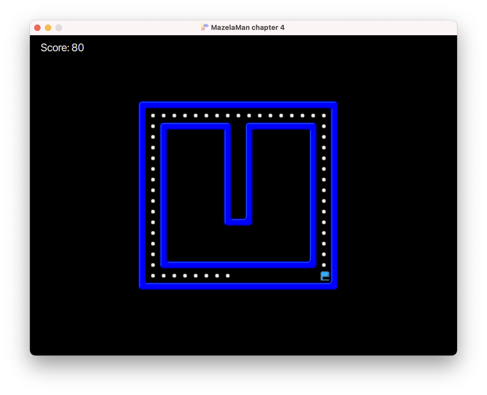

## Animation

We are now going to animate our player character when it moves around the maze. To keep the
animation code in one place, we begin by creating a custom component for the player.


### PlayerComponent

Custom components in FXGL inherit from the class `Component`.

```java
public class PlayerComponent extends Component {
    ...
}
```

We add it to the player entity the same way as other components in the entity factory. Note
that we no longer add a view with a bounding box to the entity. We only add the bounding box.
That is because the `PlayerComponent` will take care of the view.

```java
    @Spawns("Player")
    public Entity spawnPlayer(SpawnData data) {
        ...
        return entityBuilder(data)
                .type(EntityType.PLAYER)
                .bbox(new HitBox(BoundingShape.box(20, 20)))
                .with(physics)
                .with(new PlayerComponent())
                .collidable()
                .build();
    }
```

Before we can do any animation, we must create sprite sheets to base the animation on. Our 
player character will be animated differently depending on the direction, so we need several 
sprite sheets. These are the sprite sheets we will use:


You can copy them from [here](../resources) to the textures folder.


### AnimatedTexture

An animated view in FXGL is provided by an `AnimatedTexture`. The `AnimatedTexture` performs 
the animation by playing an `AnimationChannel` that provides the data for one animation 
cycle. You can at any moment change the animation channel that is played by the animated 
texture, and thereby change the animation.

For the player animation, we need one animated texture, and three animation channels, one 
for each sprite sheet.

```java
    private final AnimatedTexture texture;

    private final AnimationChannel left;
    private final AnimationChannel right;
    private final AnimationChannel upDown;
```

In the `PlayerComponent constructor we create these objects.

```java
        left = new AnimationChannel(FXGL.image("player-left.png"), Duration.seconds(0.5), 6);
        right = new AnimationChannel(FXGL.image("player-right.png"), Duration.seconds(0.5), 6);
        upDown = new AnimationChannel(FXGL.image("player-up-down.png"), Duration.seconds(0.5), 6);
        texture = new AnimatedTexture(upDown);
```

Each animation channel is created with its sprite sheet image, a value that specifies the 
duration of a single animation cycle, and the number of frames in an animation cycle. The 
animation channel automatically splits the sprite sheet into frame images based on the 
number of frames specified. So our sprite sheets will be split into six images each. There 
are other constructors in the `AnimationChannel` class. You can for example specify the frame 
images as a list of separate images instead of a sprite sheet. You can also specify the first 
and last image to use, if you have a bigger sprite sheet, where not all images should be used.

The animated texture is created with its default animation channel. This channel will be
played if you later call the play method without specifying a new channel. The texture has
not yet been attached as a view to the entity. That is because the entity has not yet been 
created. We attach the texture to the view when the `PlayerComponent` is later added to the 
entity.

```java
    @Override
    public void onAdded() {
        entity.getViewComponent().addChild(texture);
        texture.loopAnimationChannel(upDown);
    }
```

This code gets the view component of the entity, and adds the animated texture as a child
to it. It also starts playing the `upDown` animation in a loop. If you want to play an 
animation only once, there are play methods that you can use instead.

The `Component` class also has other callback methods that you can override. The method 
`onRemoved` is called right before the component is removed from the entity, and the 
method `onUpdate` is called each frame during game play

If you run the app now, you'll see that although the player is animated, the same animation
cycle is played all the time. We need to add some more code to change animation according to 
direction. Let's add methods for changing direction to the `PlayerComponent`. The `left` 
method looks like this.

```java
    public void left() {
        if (texture.getAnimationChannel() != left) {
            texture.loopAnimationChannel(left);
        }
    }
```

If the animation channel is not already equal to `left`, we make it so. Why the `if` statement? 
Can't we just always set it to `left` in the `left` method? No, because that would cause the 
animation to restart every time we call this method. So if the user keeps pressing the `A` key, 
there would be no animation, just the first frame over and over.

We can add the corresponding methods for the other directions.

```java
    public void right() {
        if (texture.getAnimationChannel() != right) {
            texture.loopAnimationChannel(right);
        }
    }

    public void up() {
        if (texture.getAnimationChannel() != upDown) {
            texture.loopAnimationChannel(upDown);
        }
    }

    public void down() {
        if (texture.getAnimationChannel() != upDown) {
            texture.loopAnimationChannel(upDown);
        }
    }
```

Of course, nothing at all will happen if we don't call these new methods. We need to call
them from the input handlers. The input handler for the `A` key will now look like:

```java
        FXGL.onKey(KeyCode.A, "Move Left", () -> {
            getPlayer().getComponent(PhysicsComponent.class).setVelocityX(-SPEED);
            getPlayer().getComponent(PlayerComponent.class).left();
        });
```

We get the `PlayerComponent` from the player entity and call the `left` method.



Now we are done! The animation works as expected. However, since we now have a 
`PlayerComponent`, we can refactor our code and move more of the player related code into the
`PlayerComponent`. We already have methods called `left`, `right`, `up`, and `down` in the
`PlayerComponent`. Let's move the actual moving of the entity into these methods as well.

```java
    private PhysicsComponent physics;

    public void left() {
        physics.setVelocityX(-SPEED);
        if (texture.getAnimationChannel() != left) {
            texture.loopAnimationChannel(left);
        }
    }

    public void right() {
        physics.setVelocityX(SPEED);
        if (texture.getAnimationChannel() != right) {
            texture.loopAnimationChannel(right);
        }
    }

    public void up() {
        physics.setVelocityY(-SPEED);
        if (texture.getAnimationChannel() != upDown) {
            texture.loopAnimationChannel(upDown);
        }
    }

    public void down() {
        physics.setVelocityY(SPEED);
        if (texture.getAnimationChannel() != upDown) {
            texture.loopAnimationChannel(upDown);
        }
    }
```

By default, the `PhysicsComponent` will be injected into the `PlayerComponent`, so it will be
available to us there. You can turn this feature off by overriding a method in `Component` 
if you want to improve the speed of entity creation. 

The refactoring will make the `initInput` method look better again.

```java
    @Override
    protected void initInput() {
        FXGL.onKey(KeyCode.A, "Move Left", () -> getPlayer().getComponent(PlayerComponent.class).left());
        FXGL.onKey(KeyCode.D, "Move Right", () -> getPlayer().getComponent(PlayerComponent.class).right());
        FXGL.onKey(KeyCode.W, "Move Up", () -> getPlayer().getComponent(PlayerComponent.class).up());
        FXGL.onKey(KeyCode.S, "Move Down", () -> getPlayer().getComponent(PlayerComponent.class).down());
    }
```

In the [next chapter](../05-chapter-5/README.md) we will add an enemy with simple AI.

[[Back](../03-chapter-3/README.md)]
[[Next](../05-chapter-5/README.md)]
[[Up](../README.md)]
