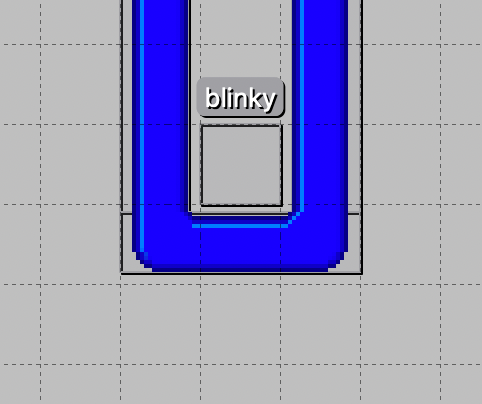
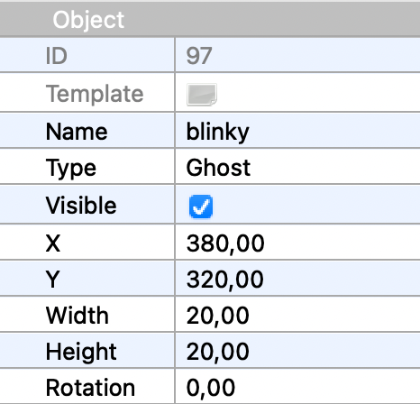
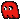
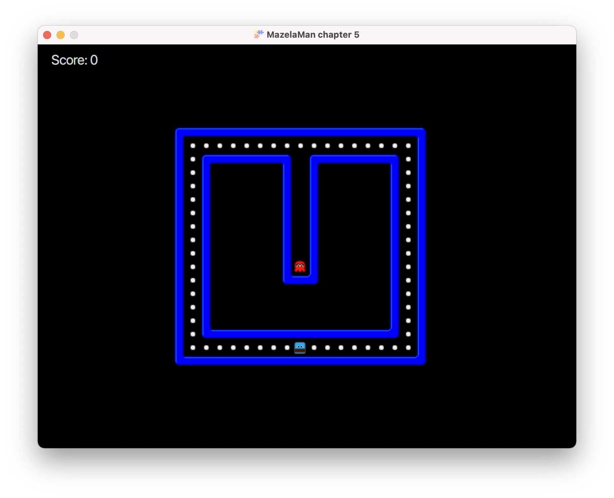
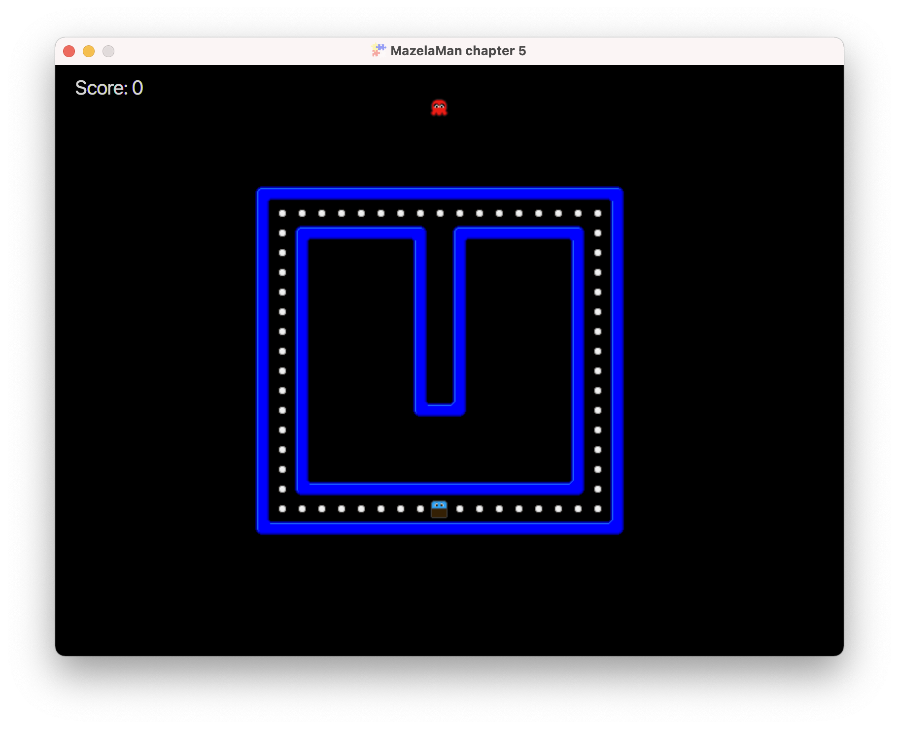

## Adding Enemies

Our current game is not much of a challenge. We can make it harder by adding an enemy or two.
This will involve more design in Tiled, adding new images, creating a new component with some
very limited AI, and creating new collision handlers.


### Position Enemies on the Map

We begin our work in Tiled as usual. It is also possible to copy the finished 
[level file](../06-chapter-6/src/main/resources/assets/levels/level1.tmx) from the next level
as usual. Otherwise, open the level file for the current chapter in Tiled, and add an enemy
object. You can of course add any number of enemies, but I will settle for one, given the
design of my level.



The new object has a little name tag above it. The enemy objects need names to keep them 
apart. We will use the name later when loading textures for the enemy entity. You enter the
name, as well as the type, in the Tiled property editor. For reasons unknown, I have chosen 
to call this object "blinky".




### Adding Images

The images we will use for enemy blinky look like this:




Copy them to the textures folder from the main [resources](../resources) folder. If you 
want more than one enemy, we have you covered. The resources folder also contains images
for pinky, inky, and clyde.


### Entity Factory

Next we want to create a spawn method for enemies. In the `MazelaManFactory`, we add:

```java
    @Spawns("Ghost")
    public Entity spawnGhost(SpawnData data) {
        return FXGL.entityBuilder(data)
                .type(EntityType.GHOST)
                .bbox(new HitBox(BoundingShape.box(20, 20)))
                .with(new GhostComponent(data.get("name"), data.getX(), data.getY()))
                .collidable()
                .build();
    }
```

Here we build a collidable entity of type `GHOST` (which must be added to the `EntityType` enum) 
with a `GhostComponent`. When creating the `GhostComponent` instance, we provide it with parts of 
the spawn data entered in Tiled. Our next task will be to create the `GhostComponent` class.


### GhostComponent

We already know how a component class should look. It should inherit `Component`, and if it
handles the entity view, it should add a texture in the `onAdded` callback method. Here we use
the name of the enemy to load the correct images.

```java
public class GhostComponent extends Component {

    private final String name;
    private final double x;
    private final double y;

    private final Texture left;
    private final Texture right;
    private final Texture upDown;

    public GhostComponent(String name, double x, double y) {
        this.name = name;
        this.x = x;
        this.y = y;
        left = FXGL.texture(name + "-left.png");
        right = FXGL.texture(name + "-right.png");
        upDown = FXGL.texture(name + "-up-down.png");
    }

    @Override
    public void onAdded() {
        entity.getViewComponent().addChild(upDown);
    }
}
```

Running the game now will provide us with a nice, albeit very static enemy.




### Adding AI

To make blinky move, we will add an update method, and very limited AI. By overriding the
`onUpdate` method, we can move the ghost entity a little every frame.

```java
    private static final double SPEED = 100.0;

    private double dx = 0.0;
    private double dy = -SPEED;

    @Override
    public void onUpdate(double tpf) {
        entity.translateX(dx * tpf);
        entity.translateY(dy * tpf);
    }
```

You may have noted that we did not set any `PhysicsComponent` on the ghost entity. Therefore,
the ghost entity is not controlled by the physics engine. Instead, we control it ourselves
by calling the translate methods.

The argument to the onUpdate method, `tpf`, means "time per frame". That is the amount of 
time in seconds that is spent on each frame and will vary depending on the speed of the 
computer. Dividing 1 by the time per frame gives the number of frames per second, or FPS. 

The time per frame can be used to make an entity move with a constant speed independent of
the speed of the computer. By multiplying `dx` and `dy` with `tpf`, we will move the entity at
a constant speed even if the FPS varies. And the FPS _will_ vary depending on what else 
happens in the game, and depending on when the Java just-in-time compiler kicks in.

Now our enemy will move, but only in one direction, and as the player before, it will move
through the walls.




### Collision Detection

The player and the enemies are already collidable, but the walls are not. A small update
to the `spawnWall` method fixes that.

```java
    @Spawns("Wall")
    public Entity spawnWall(SpawnData data) {
        return FXGL.entityBuilder(data)
                .type(EntityType.WALL)
                .bbox(new HitBox(BoundingShape.box(data.<Integer>get("width"), data.<Integer>get("height"))))
                .with(new PhysicsComponent())
                .collidable()
                .build();
    }
```

Next, we add a collision handler for a ghost and a wall. In `initPhysics`, we add:

```java
        physics.addCollisionHandler(new CollisionHandler(EntityType.GHOST, EntityType.WALL) {
            @Override
            protected void onCollisionBegin(Entity ghost, Entity wall) {
                ghost.getComponent(GhostComponent.class).turn();
            }
        });
```

Again, the order of the constructor arguments to `CollisionHandler` decides the order of the
arguments to the callback method `onCollisionBegin`. The new collision handler gets the
`GhostComponent` and calls a method turn on it. So we return to the `GhostComponent`, and 
create the `turn` method and its helper method `getRandomSpeedAndDirection`.

```java
    private static final Random RANDOM = new Random();

    public void turn() {
        if (dx < 0.0) {
            entity.translateX(2);
            dx = 0.0;
            dy = getRandomSpeedAndDirection();
        } else if (dx > 0.0) {
            entity.translateX(-2);
            dx = 0.0;
            dy = getRandomSpeedAndDirection();
        } else if (dy < 0.0) {
            entity.translateY(2);
            dy = 0.0;
            dx = getRandomSpeedAndDirection();
        } else {
            entity.translateY(-2);
            dy = 0.0;
            dx = getRandomSpeedAndDirection();
        }

        if (dx < 0.0) {
            entity.getViewComponent().removeChild(upDown);
            entity.getViewComponent().addChild(left);
        } else if (dx > 0.0) {
            entity.getViewComponent().removeChild(upDown);
            entity.getViewComponent().addChild(right);
        } else {
            entity.getViewComponent().removeChild(left);
            entity.getViewComponent().removeChild(right);
            entity.getViewComponent().addChild(upDown);
        }
    }
        
    private double getRandomSpeedAndDirection() {
        return RANDOM.nextBoolean() ? SPEED : -SPEED;
    }
```

There seems to be much going on here, but in reality we are just doing almost the same thing
for a number of different cases. The first if-else statement has to do with changing the
direction of the entity by setting `dx` and `dy` to new values. The second if-else statement
changes the view of the entity depending on the direction it moves.

The logic of the first if-else statement is _if the entity is moving left or right, it
will randomly turn up or down, and if the entity is moving up or down, it will randomly
turn left or right_. That is all there is to the AI of the ghosts in this implementation.
"But wait, you say, what about the entity.translateX(2) and similar statements?" Yes, 
that is a hack to overcome a limitation in the collision detection. Since we are not 
using the physics engine to detect the collisions between ghosts and walls, the entities
do not stop automatically when they collide. When the `onCollisionBegin` method is called,
the entities _have already_ collided, and are now overlapping in the game world. If we 
just change direction and move on, the collision will still be going on, which will cause
problems with the next collision. To avoid that, we move the entity back two pixels in
the direction it came from, which ends the collision. This does not feel like an optimal 
solution, but it is some kind of solution. Probably, the real solution is to use the physics 
engine for ghost-wall collisions as well...

The second if-else statement does not contain any mysteries. Depending on the direction
the entity is now travelling we add the correct texture to the view, after first removing 
the old texture to avoid having duplicate textures in the view.


### Player-Ghost Collisions

Hopefully, the ghost or ghosts can now move around in the maze, but we also want to
detect collisions between the player and a ghost. In case of a player-ghost collection,
both entities should respawn at their original locations. The `GhostComponent` already
knows its original location, but the `PlayerComponent` must be updated to know that too.

```java
    private final double x;
    private final double y;
    
    public PlayerComponent(double x, double y) {
        this.x = x;
        this.y = y;
        ...
    }
```

The `spawnPlayer` method must also be updated to provide the constructor with x and y
like the `spawnGhost` method already does.

We can now add methods to respawn entities in both `PlayerComponent` and `GhostComponent`.
Respawning is as easy as removing the entity from the world and spawning it again using
the saved location, and, in the case of ghosts, the saved name.

```java
public class PlayerComponent extends Component {
    
    ...
    
    public void respawn() {
        entity.removeFromWorld();
        FXGL.spawn("Player", new SpawnData(x, y));
    }
}
```

```java
public class GhostComponent extends Component {

    ...
    
    public void respawn() {
        entity.removeFromWorld();
        FXGL.spawn("Ghost", new SpawnData(x, y).put("name", name));
    }
}
```

The final step is adding a collision handler that handles player-ghost collisions. In
`initPhysics` we add:

```java
        physics.addCollisionHandler(new CollisionHandler(EntityType.PLAYER, EntityType.GHOST) {
            @Override
            protected void onCollisionBegin(Entity player, Entity ghost) {
                FXGL.getGameWorld()
                        .getEntitiesByType(EntityType.GHOST)
                        .forEach(entity -> entity.getComponent(GhostComponent.class).respawn());
                player.getComponent(PlayerComponent.class).respawn();
            }
        });
```

In this collision handler we respawn not only the ghost that collided, but _all_ ghosts, 
making all ghosts return to their original locations. Here we get all entities of type
`GHOST`, but there are many more ways to get entities from the game world. For example, you
can get the closest entity to a point, or all entities within an area. You can also get
all entities that satisfy a predicate. All depends on the type of game you are working 
on.

That's all for this chapter. In the [next chapter](../06-chapter-6/README.md) we will add 
a second level to the game.

[[Back](../04-chapter-4/README.md)]
[[Next](../06-chapter-6/README.md)]
[[Up](../README.md)]
