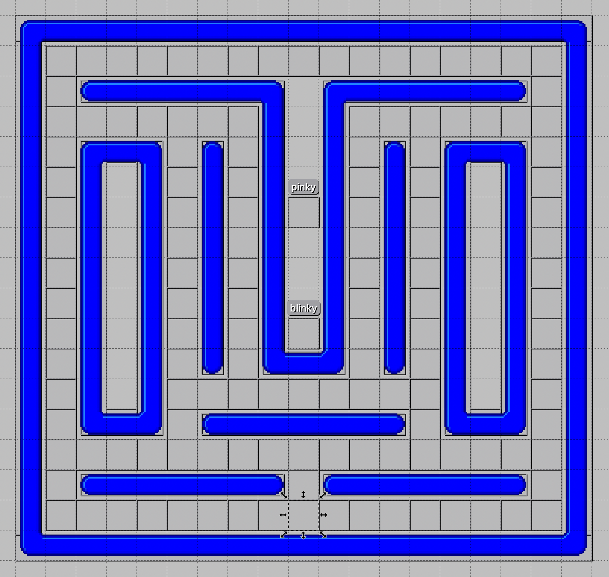
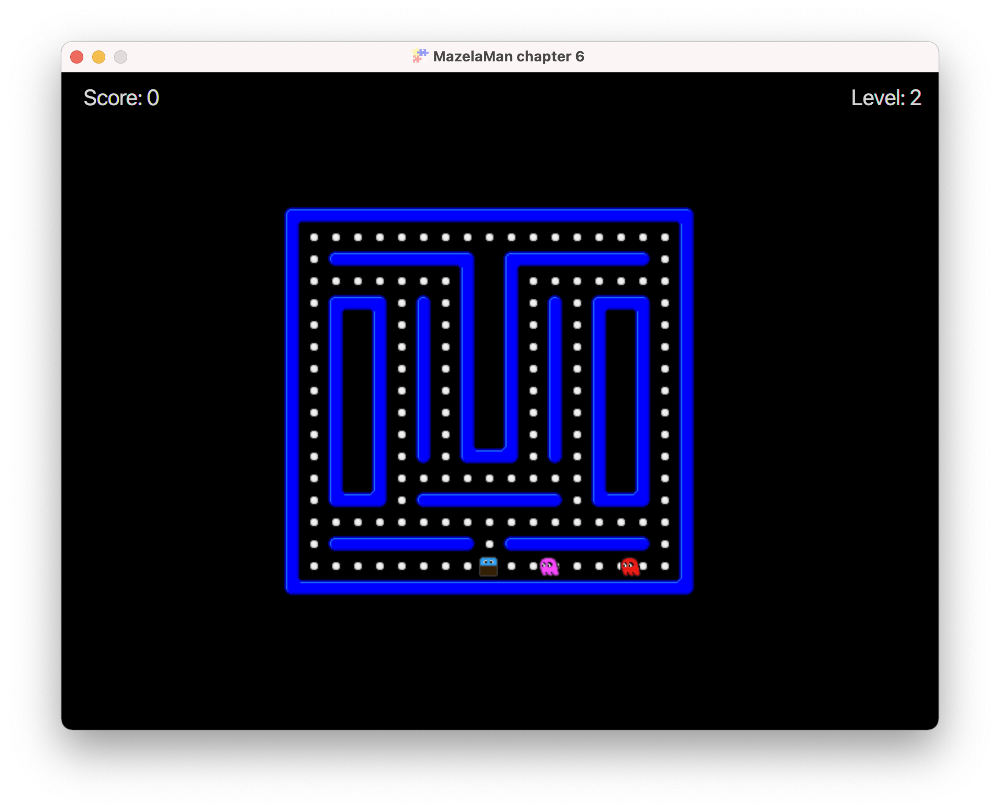

## A Second Level

Adding a second level to the game involves mostly work with designing the level in Tiled.
In addition to that, we also need to do some work in the code to keep track of the pills
eaten and the current level.


### Designing the Level

To design a new level, it is probably easiest to copy your existing level and update it.
Redesign the maze in any way you like, position the player, the ghost(s), and the pills
by creating objects with type and name. Name the new level file level2.tmx.

If you don't feel like doing all that work in Tiled, you can copy a ready-made
[level2.tmx](../07-chapter-7/src/main/resources/assets/levels/level2.tmx) file. The maze
in this file looks like this:



The player object is the highlighted object close to the bottom.

If you added any new ghosts to the new level, you will have to copy the textures for
them to the textures folder. All availale resources can be found in the main 
[resources](../reources) folder. I added "pinky", who looks like this:


### Start Level

To make it easier to test the game, we will add a command line argument to specify the
start level. Then we can easily start playing on level 2 to test that level.

There are libraries for handling command line arguments, but we will make it as easy as
possible here, and parse a single optional argument ourselves. We add a static variable
to save the start level, and make a small addition to the main method.

```java
    private static int startLevel = 1;

    public static void main(String[] args) {
        if (args.length > 0) {
            startLevel = Integer.parseInt(args[0]);
        }
        launch(args);
    }
```

We save the current level as a game variable, and create a new method that initializes a
level. The initGame method now calls initLevel instead of initializing the level itself.
The `geti` method is again a convenience method in class FXGL for getting the value of an
integer game variable.

```java
    @Override
    protected void initGameVars(Map<String, Object> vars) {
        vars.put("level", startLevel);
        vars.put("score", 0);
    }

    @Override
    protected void initGame() {
        getGameWorld().addEntityFactory(new MazelaManFactory());
        initLevel();
    }

    private void initLevel() {
        spawn("Background", new SpawnData(0, 0).put("width", WIDTH).put("height", HEIGHT));
        setLevelFromMap("level" + geti("level") + ".tmx");
    }
```

We want the level value to be visible in the UI, so we update the initUI method and add code for
a new label. This is very similar to the score label. We create a JavaFX label, set some
properties, and bind its text property to the property of the level game variable. In the
bind call we also transform the level property of type Integer to a text property of type
String. Finally, we add the label as a node at a specified position.

```java
    Label levelLabel = new Label();
    levelLabel.setTextFill(Color.LIGHTGRAY);
    levelLabel.setFont(Font.font(20.0));
    levelLabel.textProperty().bind(FXGL.getip("level").asString("Level: %d"));
    FXGL.addUINode(levelLabel, 720, 10);
```


### Counting Pills

We want the player to progress to the next level, when all pills have been eaten. Since
we don't know from the start how many they are, we have to count them. Let's do this in
the initLevel method after we have loaded the level. We simply get all entities of type
PILL, count them, and store the result in a game variable.

```java
    // Store the number of pills on this level
    FXGL.set("pills", getGameWorld().getEntitiesByType(EntityType.PILL).size());
```

Next, we modify the player-pill collision handler to decrease the number of pills each 
time the player eats a pill. There is no `dec` convenience method, so instead we increase
the number of pills with -1. If the number of remaining pills has reached 0, we start the
next level.

```java
    @Override
    protected void onCollisionBegin(Entity player, Entity pill) {
        pill.removeFromWorld();
        FXGL.inc("score", 10);
        FXGL.inc("pills", -1);
        if (geti("pills") == 0) {
            FXGL.inc("level", 1);
            Platform.runLater(() -> initLevel());
        }
    }
```

The call to `initLevel` is enclosed in a call to `Platform.runLater`. This is done to let
the current event handler finish executing before we delete the current scene and 
replace it with something entirely different. `Platform` is a JavaFX class, and the same
technique is used when working with events in JavaFX applications.

The observant reader has by now figured out that the game will crash when the player
has made it through level 2. Handling that problem gracefully is left as an exercise to 
the reader. One way could be to [create a main menu](https://github.com/AlmasB/FXGL/wiki/Customizing-Menus-%28FXGL-11%29) 
that the game would return to after clearing all levels.

Adding a new level is done. This is how my level design look in action.



Now proceed to the [next chapter](../07-chapter-7/README.md)

[[Back](../05-chapter-5/README.md)]
[[Next](../07-chapter-7/README.md)]
[[Up](../README.md)]
