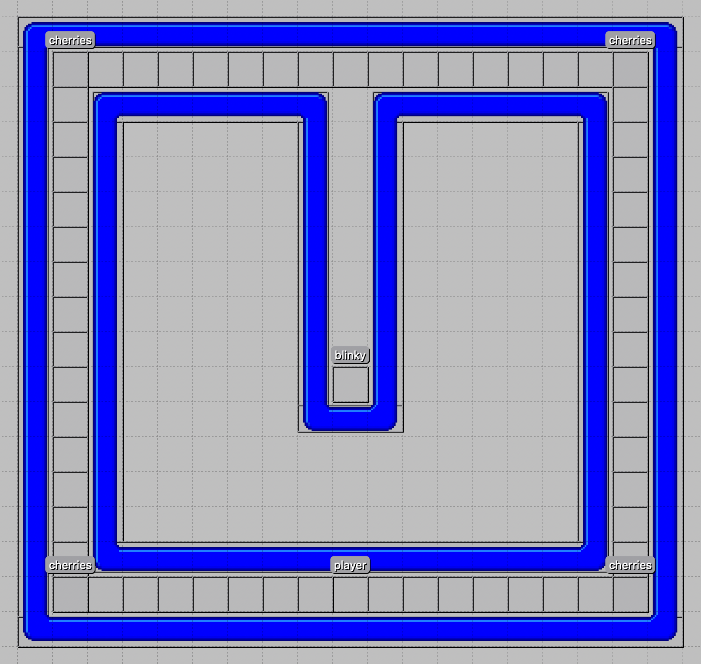
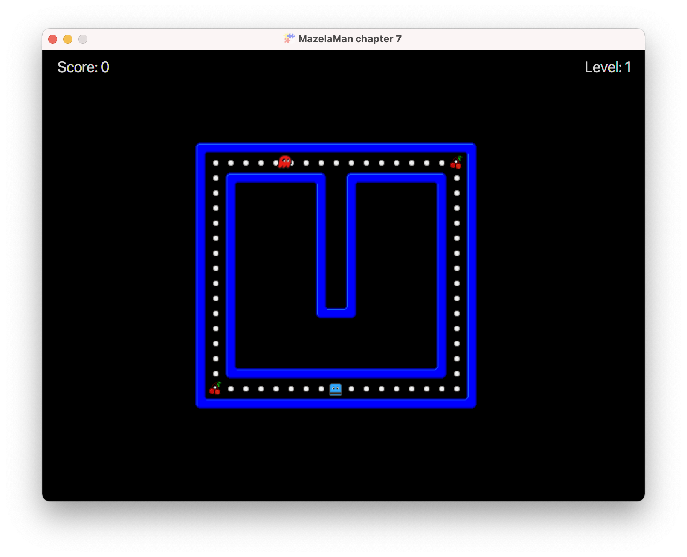

## Bonus Points

In this chapter we will add cherries that enable the player to earn bonus points. The 
cherries will spawn at well-defined spawn-points at random points in time, and remain 
visible for ten seconds before they disappear.


### Adding Cherries in Tiled

As usual, we start in Tiled. This time, you need to edit both level 1 and level 2, and
any additional levels you may have created. Or you can copy the level files from the
[next chapter](../08-chapter-8/src/main/resources/assets/levels). We will not add any
cherries, but rather cherry spawn-points to the level files. The spawn-points will
exist through the whole level even though the spawned cherries will not. I added 
spawn-points in the corners of the level 1 maze, and set the type string to 
"CherrySpawnPoint". 



We also need to copy the [cherry image](../reources/cherry.png) to the textures folder.


### Entity Factory

The next step is as always to create a new spawn method for the object we added to the
level file. In this case we will actually add two spawn methods - one for the cherry 
spawn-point, and one for the cherries.

```java
    @Spawns("CherrySpawnPoint")
    public Entity spawnCherrySpawnPoint(SpawnData data) {
        return entityBuilder(data)
                .with(new CherrySpawnComponent())
                .build();
    }

    @Spawns("Cherry")
    public Entity spawnCherry(SpawnData data) {
        return entityBuilder(data)
                .type(EntityType.CHERRY)
                .viewWithBBox("cherry.png")
                .collidable()
                .build();
    }
```

The cherry spawn-point is an invisible entity, so it does not have any view. The only 
thing it _does_ have is a CherrySpawnComponent, which we will create shortly. The 
cherries are collidable entities with a view, and a bounding box created from the view.
The cherries are of entity type CHERRY to enable them to be picked up by the player.
The EntityType enum constant CHERRY must also be created.


### CherrySpawnComponent

Here is the entire CherrySpawnComponent:

```java
public class CherrySpawnComponent extends Component {

    private static final Random RANDOM = new Random();

    @Override
    public void onUpdate(double tpf) {
        // Spawn a cherry randomly if there is not a cherry already
        if (RANDOM.nextInt(1000) == 0 && noCherryAt(entity.getX(), entity.getY())) {
            Entity cherry = FXGL.spawn("Cherry", new SpawnData(entity.getX(), entity.getY()));
            despawnLater(cherry);
        }
    }

    private void despawnLater(Entity cherry) {
        Timer timer = new Timer();
        timer.schedule(new TimerTask() {
            @Override
            public void run() {
                Platform.runLater(cherry::removeFromWorld);
                timer.cancel();
            }
        }, 10_000);
    }

    private boolean noCherryAt(double x, double y) {
        return FXGL.getGameWorld().getEntitiesByType(EntityType.CHERRY)
                .stream()
                .noneMatch(e -> e.getX() == x && e.getY() == y);
    }
}
```

The CherrySpawnComponent has an `onUpdate` method that is called on every tick. Every
time this method is called, there is one chance in 1000 to spawn a cherry, if there is
not already a cherry at that position. Note that the component does not need to remember
its own position, because it has access to the entity it is part of, and the entity has 
the position.

If we are lucky, and a cherry should be spawned, `onUpdate` calls one of the `spawn` 
methods in `FXGL`, which in turn uses some reflection magic to call the `spawnCherry`
method in our entity factory. We get back a reference to the created entity, and this 
reference is passed to a method that starts a timer that triggers after 10 seconds, and
then removes the cherry again.

The call to `removeFromWorld` is wrapped in a call to `Platform.runLater`. This time
we do this to ensure that the call to `removeFromWorld` is performed on the JavaFX 
Application Thread. JavaFX and FXGL require all calls to the framework to be made on
the JavaFX Application Thread to work properly. Normally, that is no problem because
all callback methods are called on this thread, but the timer we create run on its own
thread in the background.

The helper method `noCherryAt` just checks that there is no entity of type `CHERRY` at
the specified position. An alternative implementation of this method could have retrieved
all entities at the specified position using `getEntitiesAt` and then checked that none
of them was of type `CHERRY`.


### Collision Handling

The player-cherry collision handler is very straight forward, and I almost feel it
unnecessary to state it here, but anyway, here it is:

```java
    physics.addCollisionHandler(new CollisionHandler(EntityType.PLAYER, EntityType.CHERRY) {
        @Override
        protected void onCollisionBegin(Entity player, Entity cherry) {
            cherry.removeFromWorld();
            FXGL.inc("score", 100);
        }
    });
```



This completes this chapter. Move on to the [next chapter](../08-chapter-8/README.md)
where we will add sound to the game.

[[Back](../06-chapter-6/README.md)]
[[Next](../08-chapter-8/README.md)]
[[Up](../README.md)]
