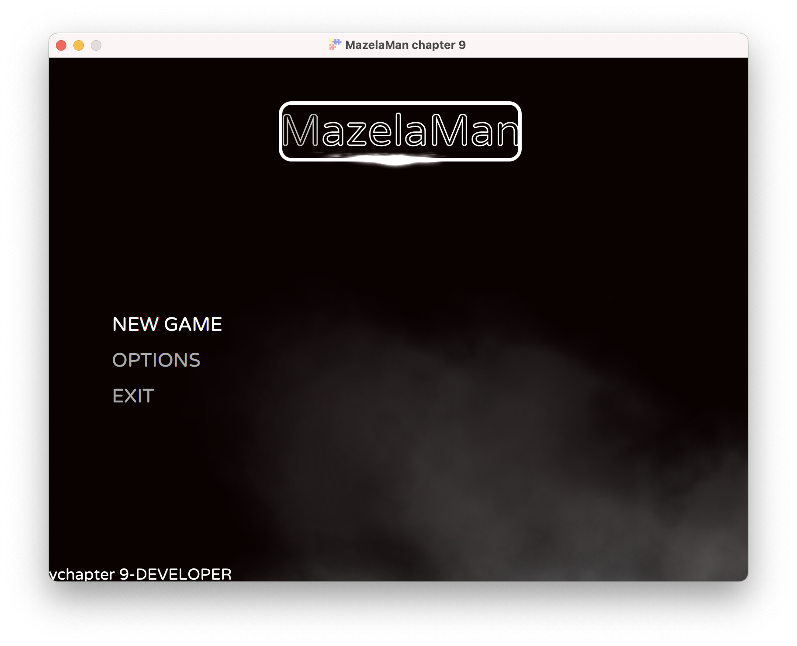
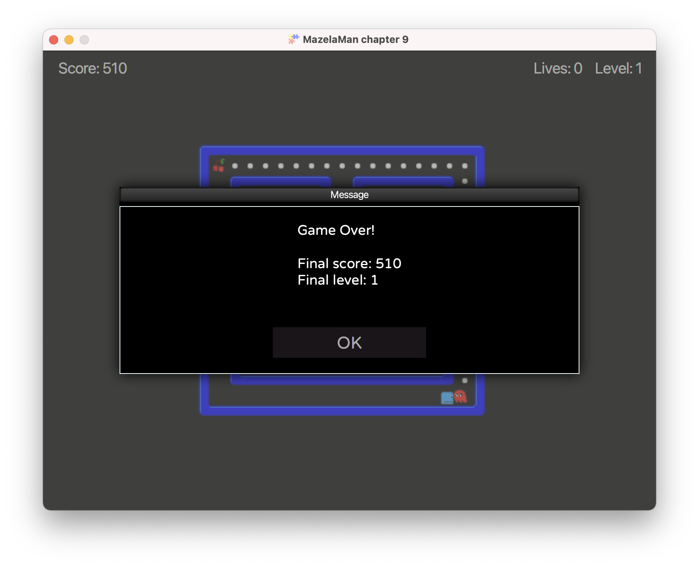

## Enable Main Menu

We have already seen the in-game menu that you get for free in FXGL. There is also a
main menu that is displayed when the app starts, but it is not enabled by default. We
will enable the main menu, and also add functionality to return to the main menu after
a game has finished.

Enabling the main menu is as easy as a single line in `initSettings`. Check out the
`GameSettings` class for other settings you can set, for example the seed for the 
random number generator.

```java
    settings.setMainMenuEnabled(true);
```

If you start the application now, it will begin by displaying the main menu.




### Counting Lives

We want to return to the main menu when the game is over. The game can end in two ways.
Either the player runs out of lives, or the player finishes the last level. To implement
the first, we need to keep track of the number of lives left. That means a new game
variable that we initialize in `initGameVars`, a new UI label that we create in `initUI`,
and some counting in a collision handler.

```java
    vars.put("lives", 3);
```

```java
    Label livesLabel = new Label();
    livesLabel.setTextFill(Color.LIGHTGRAY);
    livesLabel.setFont(Font.font(20.0));
    livesLabel.textProperty().bind(FXGL.getip("lives").asString("Lives: %d"));
    FXGL.addUINode(livesLabel, 640, 10);
```

```java
    physics.addCollisionHandler(new CollisionHandler(EntityType.PLAYER, EntityType.GHOST) {
        @Override
        protected void onCollisionBegin(Entity player, Entity ghost) {
            FXGL.play("death.wav");
            FXGL.inc("lives", -1);
            if (geti("lives") > 0) {
                FXGL.getGameWorld()
                        .getEntitiesByType(EntityType.GHOST)
                        .forEach(entity -> entity.getComponent(GhostComponent.class).respawn());
                player.getComponent(PlayerComponent.class).respawn();
            } else {
                gameOver(false);
            }
        }
    });
```

Now, when the player collides with a ghost, we decrease the number of lives. If there
are still lives left, we respawn the player and ghosts like before. If the number
of lives has reached 0, we instead call the `gameOver` method that we will create
shortly.

However, we will first make some changes to the code handling levels. We want to call
the `gameOver` method also when the player has finished the last level. We could create
a constant that holds the number of levels in the game, but then we would have to update
that constant whenever we add a new level. Instead, we settle for a more dynamic option 
to catch the exception that is thrown when the next level is not found. Now we can just 
create a new level file, and the game will automatically use that level.

Instead of calling `setLevelFromMap` directly from `initLevel`, we call a new method
`setLevelFromMapOrGameOver`.

```java
    private void initLevel() {
        spawn("Background", new SpawnData(0, 0).put("width", WIDTH).put("height", HEIGHT));
        setLevelFromMapOrGameOver();
        // Store the number of pills on this level
        FXGL.set("pills", getGameWorld().getEntitiesByType(EntityType.PILL).size());
    }
```

```java
    private void setLevelFromMapOrGameOver() {
        try {
            setLevelFromMap("level" + geti("level") + ".tmx");
        } catch (IllegalArgumentException e) {
            gameOver(true);
        }
    }
```

The exception we can catch is `IllegalArgumentException` which is a bit unspecific,
but it will have to do. If we catch the exception, we also call the `gameOver` method,
but this time with parameter `true`.

In the `gameOver` method we display a message dialog before returning to the main menu.

```java
    private void gameOver(boolean reachedEndOfGame) {
        StringBuilder builder = new StringBuilder();
        builder.append("Game Over!\n\n");
        if (reachedEndOfGame) {
            builder.append("You have reached the end of the game!\n\n");
        }
        builder.append("Final score: ")
                .append(FXGL.geti("score"))
                .append("\nFinal level: ")
                .append(FXGL.geti("level"));
        getDialogService().showMessageBox(builder.toString(), () -> FXGL.getGameController().gotoMainMenu());
    }
```

The boolean parameter tells us if the player reached the end of the game, or just died. We
want to display slightly different messages in the two cases. To display the dialog to the
player, we use the FXGL `DialogService` that we get from the `FXGL` facade. Besides
`showMessageBox` that we use, the dialog service provides several other types of dialogs,
like input dialogs, error dialogs, and progress dialogs. The `showMessageBox` method we use
take two input parameters. The first is the text to display, and the second is a `Runnable`
to run when the player clicks the OK button. In our case, the runnable we provide gets the
`GameController` from the facade, and tells it to go to the main menu. The `GameController`
can also do much more, like pausing the game engine or display a loading screen.

Running the game again, and running out of lives, will now produce something like this:



This is the end of this chapter. Now you can proceed to the 
[next chapter](../10-chapter-10/README.md), which currently is the end of the tutorial.

[[Back](../08-chapter-8/README.md)]
[[Next](../10-chapter-10/README.md)]
[[Up](../README.md)]
